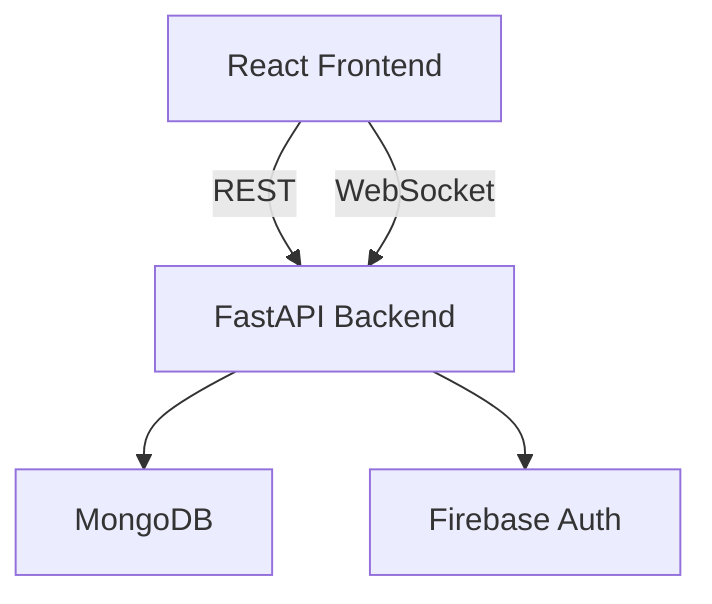

# Skill Exchange Platform Documentation

## 1. Project Overview

**Skill Exchange Platform for Students** is a web-based peer-to-peer learning system where college students barter skills. Users register using Firebase, list skills they can teach, search for skills they want to learn, and exchange sessions without mandatory payment. Realtime chat, ratings, and notifications build trust.

The project is academically oriented: no complex machine learning, no unrealistic scalability claims. It is built with modern, widely taught technologies: React.js frontend, FastAPI backend, MongoDB, and Firebase authentication.

## 2. Problem Statement

Many students have valuable skills but lack a platform for structured peer-to-peer learning. Traditional tutoring can be costly or inaccessible. A simple barter system encourages collaboration and knowledge sharing without monetary barriers.

## 3. Objectives

1. Provide authenticated access for students.
2. Allow users to create and update their profiles with offered/wanted skills.
3. Enable search and discovery of skills across users.
4. Facilitate skill exchange requests and manage their lifecycle.
5. Support session creation and track completion.
6. Offer real-time chat during sessions.
7. Implement rating/feedback to build reputation.
8. Notify users of relevant events.

## 4. Features

- **User Authentication** via Firebase; backend verifies tokens.
- **Profile Management** (name, email, skills, availability, reputation).
- **Skill Discovery** with search filters.
- **Barter Flow**: send/accept/reject, with notifications.
- **Session Management** tracking active/completed exchanges.
- **Real-time Chat** over WebSocket restricted to session participants.
- **Rating & Feedback** post-session; reputation recalculated.
- **In-app Notifications** for requests/status/session events.
- **Optional Paid Learning** noted but minimal; not implemented.

## 5. System Architecture

The application follows a **client-server** architecture:

- **Frontend**: React app served by Vite during development; communicates with backend via REST and WebSocket. Authentication tokens are stored locally and attached to all API requests.
- **Backend**: FastAPI service exposing REST endpoints under `/` path. MongoDB is accessed asynchronously through Motor. Firebase Admin SDK verifies ID tokens. WebSockets handle chat; only authenticated, authorized users may connect.

The backend is stateless regarding sessions; MongoDB stores persistent state. Notifications are stored and can be polled by the client.

### Component Diagram



> The frontend sends direct requests to `http://127.0.0.1:8000` via Axios base URL (no `/api` prefix).

## 6. Flowchart Explanation

1. **Login**: User authenticates via Firebase; token sent to `/auth/login`. Backend inserts user if new.
2. **Profile**: User reads/updates profile through `/profiles` endpoints.
3. **Skill Discovery**: User fetches `/skills` with optional search query.
4. **Request**: User posts a skill request; recipient accepts/rejects. Notifications generated.
5. **Session**: Upon acceptance, a session document is created; both users are notified.
6. **Chat**: Participants connect to `ws://.../chat/ws/{session_id}` (token required). Messages persisted.
7. **Rating**: After marking session complete, users call `/ratings` to rate each other; reputation updated.
8. **Notifications**: Client polls `/notifications/me` to display updates.

## 7. Database Schema Explanation

See README for detailed collection fields. Each collection is described with key fields and relationships. Relationships are implemented by storing foreign IDs (e.g. `user_id`, `session_id`). ObjectIds are used for documents created by Mongo; user documents use Firebase UID as `_id` for easy integration.

## 8. API Documentation

Interactive docs available at `http://localhost:8000/docs`. Key routes summary is in README. Every endpoint uses Pydantic for validation and returns proper HTTP codes.

Example request/response:

```http
POST /requests HTTP/1.1
Authorization: Bearer <token>
Content-Type: application/json

{ "to_user_id": "uid456", "skill_offered": "Java", "skill_requested": "React" }
```

```json
{ "id": "605c5d...", "from_user_id": "uid123", "to_user_id": "uid456", "skill_offered": "Java", "skill_requested": "React", "status": "pending" }
```

## 9. Expected Results

- Users can register and maintain profiles.
- They can search available skills and send barter requests.
- Accepted requests spawn sessions and allow chat.
- After completion, ratings adjust reputation.
- In-app notification center shows new events.
- Frontend displays simple UIs for each page; while minimal, functionality is demonstrable.

## 10. Future Scope

- Implement optional payments with Stripe/PayPal.
- Add categories/tags and advanced search.
- Push notifications (email or mobile).
- Enhance UI/UX using Tailwind CSS or Material UI.
- Add group sessions or community forums.
- Strengthen security and add rate limiting.

## 11. References

- **FastAPI** – documentation and tutorials.
- **Firebase** – authentication guides.
- **MongoDB** – aggregation and indexing.
- **React.js & Vite** – frontend development.
- Academic papers on peer-assisted learning (optional citations).

---

This documentation supports both development and the academic viva; each component is simple to explain and trace. The codebase follows good practices: separated concerns, readability, comments, and validation. You can run the backend and frontend with the instructions above, and the interactive docs help testing.
